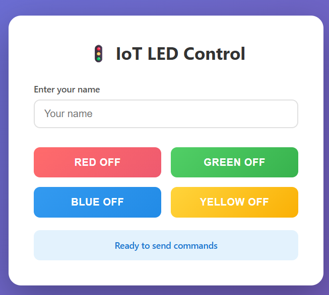

# IoT 2025 - 

# Lab 2 - ESP32 + HTTP (ThingSpeak) + ArduinoJson - LEDs from Cloud

You need to finish following exercises

### Setup Configuration in this Wokwi Project template:

- RED LED - `D26`
- Green LED - `D27`
- Blue LED - `D14`
- Yellow LED - `D12`


- Button (Active high) - `D25`
- Light sensor (analog) - `D33`


- LCD I2C - SDA: `D21`
- LCD I2C - SCL: `D22`




----------
## Goal 
In this lab, your ESP32 connects to the internet and **reads** LED states from the cloud via a given **HTTP** API. Based on the response, it **turns ON/OFF** the four LEDs: **Red (D26)**, **Green (D27)**, **Blue (D14)**, **Yellow (D12)**.
You will run this in **Wokwi** inside **VS Code** + **PlatformIO**.  


* You will write **your solution code** in `src/lab2_ex1.ino` **file**.

----------
## Requirements
* Tools: VS Code, PlatformIO extension, Wokwi extension (free, registered).
  If you don’t have Wokwi in VS Code, follow the setup guide: [LINK](https://docs.wokwi.com/vscode/getting-started).
* **Pins**: LEDs -> `D26`(Red), `D27`(Green), `D14`(Blue), `D12`(Yellow). Button `D25` exists but **not used** here.
* **Networking**: Wi-Fi SSID: `Wokwi-GUEST`, **no password.**
* **HTTP only** (not HTTPS). Use **ArduinoJson v7** for parsing.

Your repo template includes extra hardware; for this lab we only use the LEDs.  


----------
## ThingSpeak (shared channel)

* **Write API** (done for you by a web page):  
    Example:

```arduino
http://api.thingspeak.com/update?api_key=H1R8L3H5EYZTLZ4O&field1=HIGH&field2=LOW&field3=HIGH&field4=HIGH&field5=Sardor
```

*Free tier rule*: **>= 16 sec** between writes (buttons on the web page `index.html` are disabled until then).

- Field mapping here is fixed as follows:  
    - `field1` = Red LED
    - `field2` = Green LED
    - `field3` = Blue LED
    - `field4` = Yellow LED
    - `field5` = Name
  

----------
* **Read API** (you will use this in your ESP32 code):  
    Example:

```arduino
http://api.thingspeak.com/channels/3109942/feeds.json?results=1
```

- Here is the **format of the response** (JSON)  
    Example:
    
```json
{
  "channel": {
    "id": 3109942,
    "name": "iot25",
    "field1": "redled",
    "field2": "greenled",
    "field3": "blueled",
    "field4": "yellowled",
    "field5": "name",
    "last_entry_id": 5
  },
  "feeds": [
    {
      "created_at": "2025-10-10T14:22:20Z",
      "entry_id": 5,
      "field1": "HIGH",
      "field2": "LOW",
      "field3": "HIGH",
      "field4": "HIGH",
      "field5": "Sardor"
    }
  ]
}
```

We are interested in the `feeds` array, and inside it, the first (and only) object. It contains the fields `field1`, `field2`, `field3`, `field4` which correspond to the four LEDs. The values will be either `"HIGH"` or `"LOW"`; and `field5` is a name string.  

----------
* In the repo there is an `index.html` with four buttons and a name box. 
  
* Opening it **in a browser** will send the write requests above. You can inspect the page source to see the HTTP calls it makes.

----------
## What your ESP32 program must do

----------
`setup()`  

1. Configure LED pins (`D26, D27, D14, D12`) as **OUTPUT**; set all **LOW** initially.  
2. `Serial.begin(115200)` and print `<Your Name>, Lab 2`.  
3. Set Wi-Fi to **station mode** (`WIFI_STA`) and connect to `Wokwi-GUEST` (no password).  
4. Wait until connected; then **print IP address**.  

----------
`loop()`  

1. If Wi-Fi is disconnected, **retry** connecting and print status.  

2. If Wi-Fi is connected:  
   - Create an **HTTP client** and **GET** the Read API.  
   - If the HTTP code is **not 200**, print `HTTP error: <code>` and skip the rest.  
   - Otherwise, read the payload into a `String`, print the **raw JSON** to Serial.  
   - Parse with **ArduinoJson v7** (`JsonDocument` + `deserializeJson`).  
   - Extract `["field1"]..["field4"]` into four strings from the last `feeds` object in JSON response.  
   - For each LED: if the string is `"HIGH"` -> `digitalWrite(..., HIGH);` if `"LOW"` -> `digitalWrite(..., LOW);`.  
   *(Any other/empty value: treat as LOW.)*  
   - If JSON parsing fails, print the error and skip updating LEDs that cycle
   - **End** the HTTP connection.  
  
3. **Delay 5000 ms** (read every ~5 s).


## Quick tips (just HINTS)

- Use `WiFi.status() == WL_CONNECTED` to check connection.
- Use `WiFi.localIP().toString()` to get IP address as a string.
- Use `HTTPClient` class from `#include <HTTPClient.h>`.
- Use `http.begin(url)` and `http.GET()`.
- Use `http.getString()` to get the response payload.
- Use `JsonDocument doc;` from `#include <ArduinoJson.h>` to create an object that handles the parsing.
- Use `deserializeJson(doc, jsonString)` to parse.
- Use `doc["feeds"][0]["field1"]` to access fields.
- Use `digitalWrite(pin, value)` to set LED states.
- Use `http.end()` to close the connection.
- Use `delay(5000)` for 5 seconds delay.
- Use `Serial.println()` for printing to Serial Monitor.


## Checklist
- [ ] On startup, Serial prints `your name and lab-2`  
- [ ] ESP32 connects to `Wokwi-GUEST` and prints its **IP**  
- [ ] Every ~5 sec: perform **HTTP GET** request to the **Read API**, get the response as **raw JSON** string, print it to Serial, parse it using ArduinoJson library and update all 4 LEDS accordingly.  
- [ ] Response code other than 200 is printed as error, but program keeps running and retries again
